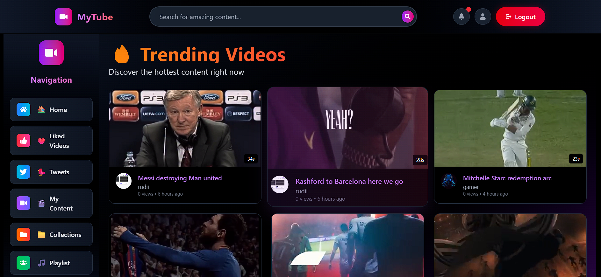
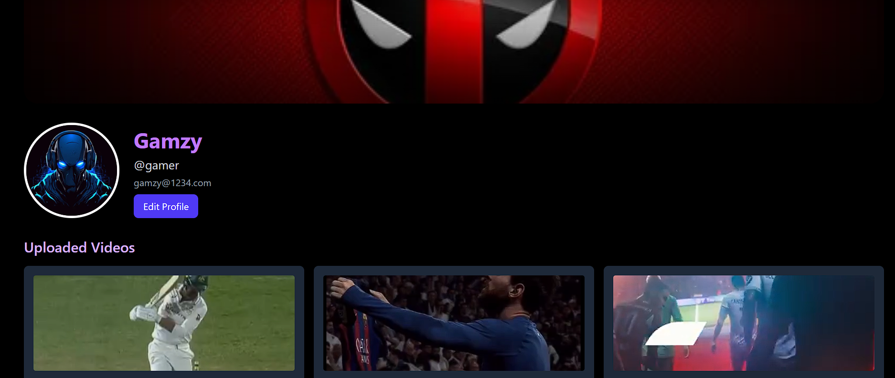
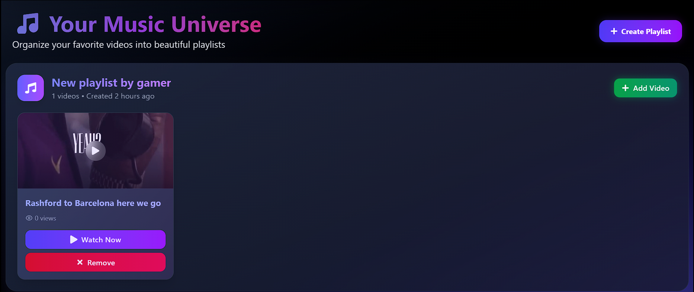
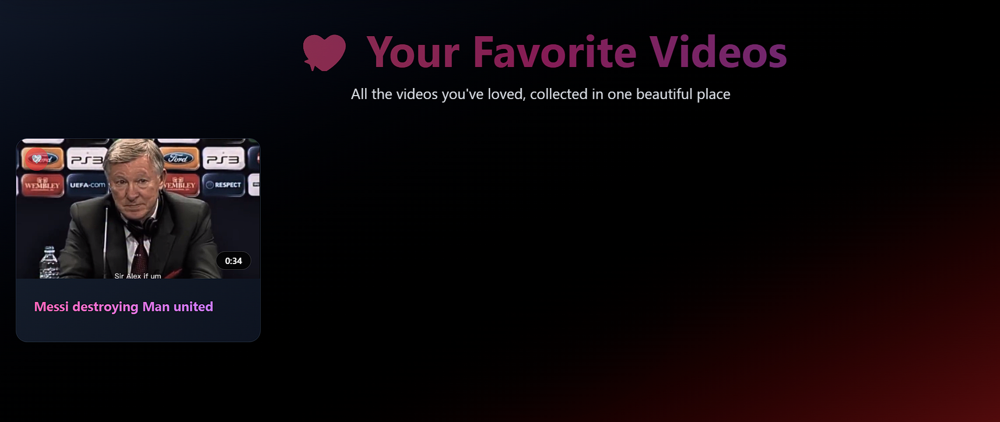
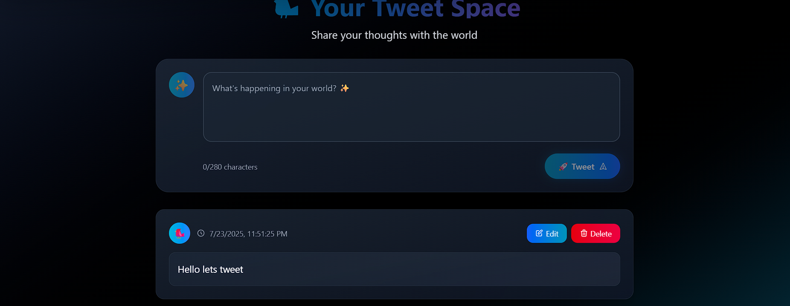
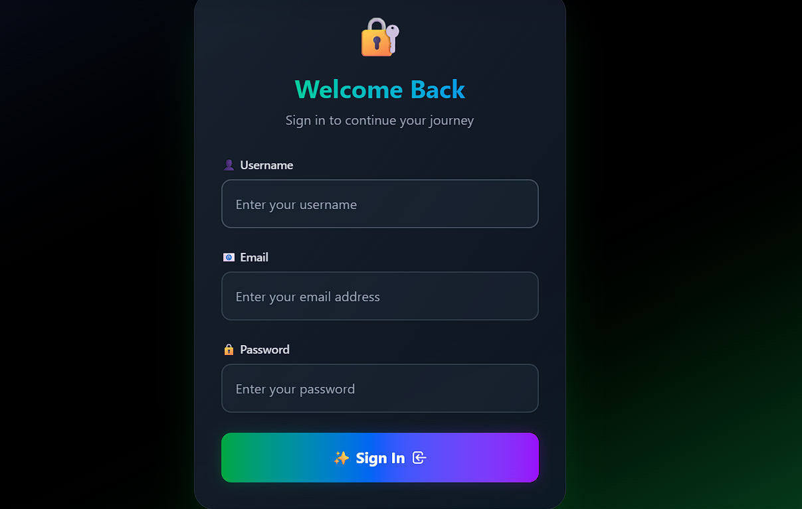
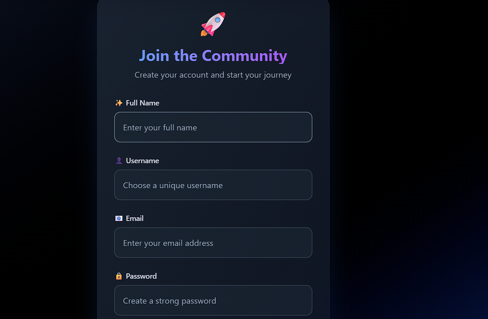

# 🎥 MyTube - A Full-Stack YouTube Clone

Welcome to **MyTube**, a full-stack YouTube clone built with modern web technologies. It lets users upload, like, and organize videos in playlists, manage their profile, and explore content across multiple pages.

## 🚀 Features

- 🔐 **JWT Authentication**
  - User login & signup functionality
  - Protected routes using tokens
- 🏠 **Home Page**
  - Display all public videos
  - Explore what others are watching

<!-- Insert Home page screenshot here -->

- 👤 **Dashboard**
  - View and manage user’s channel info
  - Displays stats and uploaded videos

<!-- Insert Dashboard screenshot here -->

- 🎞️ **Playlists**
  - Create custom playlists
  - Add/remove videos
  - Drag and drop videos to reorder

<!-- Insert Playlist screenshot here -->

- ❤️ **Liked Videos**
  - Automatically stores videos the user likes
  - Only visible to the user

<!-- Insert Liked Videos screenshot here -->

- 🐦 **Tweets Page**
  - A creative section to allow YouTube-like social posts
  - Display user tweets or short video updates

<!-- Insert Tweets Page screenshot here -->

## 🧰 Tech Stack

### Frontend

- React
- Redux Toolkit
- React Router
- Axios
- Tailwind CSS

### Backend

- Node.js
- Express.js
- MongoDB + Mongoose
- Multer (for uploads)
- JSON Web Tokens (JWT)
- Cloudinary

## 🔐 Authentication

- JWT stored in localStorage for session persistence
- Login/Signup pages validate and securely authenticate users

<!-- Insert Login/Signup screenshots here -->

## 🗂️ Folder Structure (Client)

