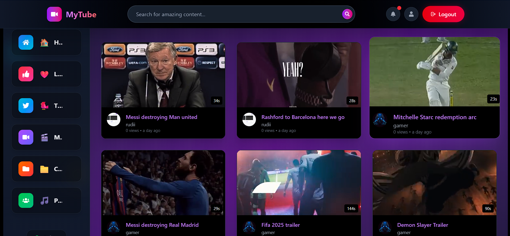

# 🎥 MyTube - A Full-Stack YouTube Clone

Welcome to **MyTube**, a full-stack YouTube clone built with modern web technologies. It lets users upload, like, and organize videos in playlists, manage their profile, and explore content across multiple pages.

## 🚀 Features

- 🔐 **JWT Authentication**
  - User login & signup functionality
  - Protected routes using tokens
- 🏠 **Home Page**
  - Display all public videos
  - Explore what others are watching
<!-- Task-->
<!-- Home page screenshot here -->

- 👤 **Dashboard**
  - View and manage user’s channel info
  - Displays stats and uploaded videos

<!-- Dashboard screenshot here -->

- 🎞️ **Playlists**
  - Create custom playlists
  - Add/remove videos
  - Drag and drop videos to reorder

<!-- Playlist screenshot here -->

- ❤️ **Liked Videos**
  - Automatically stores videos the user likes
  - Only visible to the user

<!-- Liked Videos screenshot here -->

- 🐦 **Tweets Page**
  - A creative section to allow YouTube-like social posts
  - Display user tweets or short video updates

<!--Tweets Page screenshot here -->

## 🧰 Tech Stack

### Frontend

- React
- Redux Toolkit
- React Router
- Axios
- Tailwind CSS

### Backend

- Node.js
- Express.js
- MongoDB + Mongoose
- Multer (for uploads)
- JSON Web Tokens (JWT)
- Cloudinary

## 🔐 Authentication

- JWT stored in localStorage for session persistence
- Login/Signup pages validate and securely authenticate users

<!-- Login/Signup screenshots here -->

## 🗂️ Folder Structure (Client)

Frontend/
├── public/
├── src/
│   ├── components/       # Reusable UI components
│   ├── pages/            # Route-based pages (Home, Dashboard, etc.)
│   ├── features/         # Redux slices (user, videos, playlists)
│   ├── services/         # Axios-based API logic
│   └── App.jsx
├── index.html
├── vite.config.js
├── package.json
└── README.md

## 🗂️ Folder Structure (Server)

Backend/
├── Public/               # Static assets or uploads
├── src/
│   ├── controllers/      # Route handler logic
│   ├── db/               # Database connection and config
│   ├── middlewares/      # Express middleware functions
│   ├── models/           # Mongoose schemas
│   ├── routes/           # API route definitions
│   └── utils/            # Helper functions
├── app.js                # Main Express app
├── constants.js
├── index.js              # Entry point
├── package.json
└── .gitignore

screenshots/              # Screenshots used in README
README.md                 # Project documentation
